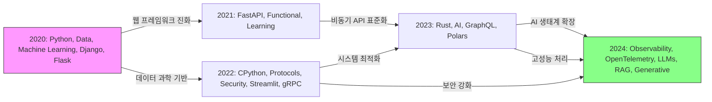

## 서론  
이 글은 2020년부터 2024년까지 EuroPython 컨퍼런스 유튜브 영상 데이터에서 TF-IDF로 추출한 핵심 기술 키워드를 분석한 결과를 담고 있습니다. 연도별 대표 키워드를 통해 컨퍼런스 주제의 변천사를 살펴봅니다.

## 1. 연도별 주요 기술 키워드  
- **2020년**  
  - 전통 웹·데이터 스택: `django`, `docker`  
  - 데이터 과학 워크플로우: `data`, `science`, `model`, `ml`  
  - 개발 도구: `flask`, `pipeline`, `processing`, `cluster`  

- **2021년**  
  - API & 프레임워크: `fastapi`, `api`, `django`, `frameworks`  
  - 머신러닝 입문: `machine`, `learning`, `testing`  
  - 생산성 향상: `pandas`, `tools`, `science`, `open source`  

- **2022년**  
  - 대화형 분석: `jupyter`, `notebook`  
  - 서비스 보안·운영: `security`, `api`, `web`, `cloud`  
  - 시스템 안정성: `software`, `database`, `build`  

- **2023년**  
  - 고성능 언어·프로토콜: `rust`, `graphql`  
  - 벡터 데이터 처리: `polars`, `vector`, `database`  
  - 브라우저 기반 AI: `ai`, `browser`, `model`  

- **2024년**  
  - 운영 관측성: `observability`, `opentelemetry`  
  - 생성형 AI 워크플로우: `llms`, `rag`, `generative`  
  - 엔드투엔드 개발: `test`, `development`, `performance`  

## 2. 기술 토픽 변화 흐름  
1. **웹·데이터 스택 → API & ML**  
   - 2020년 전통적 Django/Docker 기반 데이터 과학에서  
   - 2021년 FastAPI·테스트 자동화·머신러닝 입문으로 확대  

2. **운영·보안 강화**  
   - 2022년 Jupyter 대화형 분석과 함께 보안(`security`), 클라우드(`cloud`) 중심으로 이동  

3. **시스템 언어·고속 데이터 처리**  
   - 2023년 Rust·GraphQL·벡터 DB를 활용한 대규모 워크로드 부상  

4. **관측성 & 생성형 AI**  
   - 2024년 OpenTelemetry 기반 모니터링과 RAG/LLM 기반 생성형 AI 통합  

## 3. 결론  
EuroPython의 기술 무게추는 “개발 프레임워크 → 운영·보안 → 고성능 시스템·데이터 → 모니터링 & 생성형 AI” 순으로 이동해 왔습니다. 2024년에는 AI 모델 개발에서 나아가, 안정적 운영과 관측성까지 통합하는 엔드투엔드 워크플로우가 필수입니다.

1. **엔드투엔드 데모 세션**  
   - 예: “모델 학습 → FastAPI 배포 → OpenTelemetry 모니터링” 과정을一회에 시연  
2. **키워드 태그 활용**  
   - 프로그램북·웹페이지에 `#Observability`, `#LLM`, `#RAG` 등 태그를 적용해 관심 유도  
3. **실습형 튜토리얼 강화**  
   - “FastAPI + Vector DB + RAG 챗봇 구축하기”  
   - “OpenTelemetry로 Python 서비스 관측하기”

