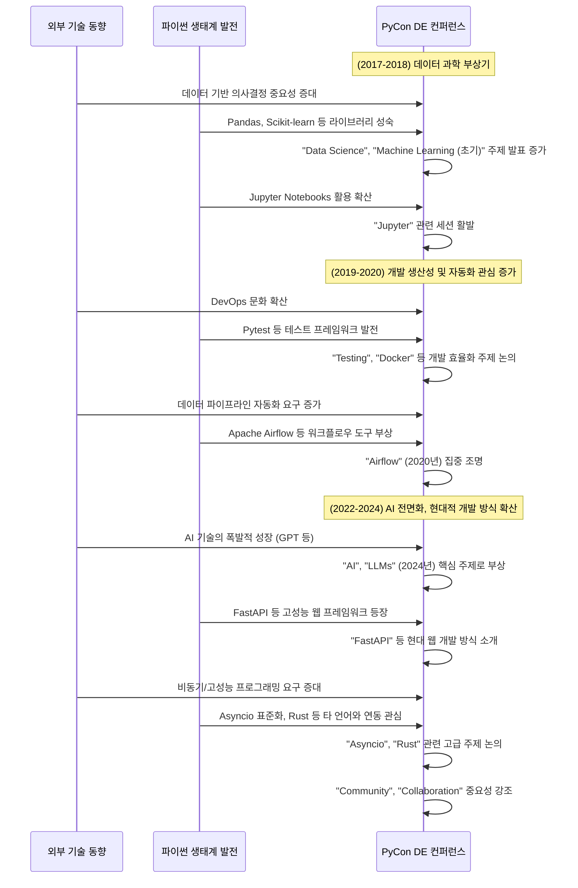

# PyCon DE & PyData Berlin 기술 트렌드 분석 (2017–2024)

**PyCon DE & PyData Berlin** 컨퍼런스는 독일 파이썬 및 데이터 커뮤니티의 핵심 행사로, 매년 최신 기술 동향과 혁신적인 아이디어가 공유되는 장입니다.  
본 포스트에서는 2017년부터 2024년까지 (2021년, 2023년 제외) 컨퍼런스 발표 내용을 바탕으로 기술 트렌드의 흐름을 정리합니다.

## 1. 기술 트렌드의 흐름: 연도별 핵심 변화

### 🧪 초기 (2017–2018): 데이터 과학의 태동과 인터랙티브 환경의 부상

- **2017년**
  - 주요 키워드: `data` (0.0749), `python` (0.0603), `learning` (0.0333)
  - 주요 도구: `pandas`, `apache`, `jupyter`
  - 특이점: `sonic pi`, `blender` 등 창의적 활용 사례 발표

- **2018년**
  - 인터랙티브 환경 도구: `jupyter` (0.0109), `notebooks` (0.0112)
  - 기술 스택의 다양화: `PyTorch`, `TensorFlow`, `Docker`
  - 품질 향상 시작: `testing` 키워드 등장

> 💡 **요약:**  
> 파이썬 기반 데이터 분석과 머신러닝이 주류로 부상하던 시기.  
> Jupyter Notebooks가 데이터 과학의 중심 도구로 자리 잡음.

---

### 🚀 중기 (2019–2020): 생산성 향상과 데이터 엔지니어링 특화

- **2019년**
  - 키워드 트렌드: `https` (0.1954), `twitter` (0.1632)
  - 주요 기술: `pytest`, `docker`
  - 개최지 변경: Karlsruhe → Berlin

- **2020년**
  - 핵심 주제: `airflow` (0.2601), `pipeline`, `workflow`
  - 데이터 파이프라인 자동화 관심 증가

> 💡 **요약:**  
> 코드 품질, 자동화, DevOps에 대한 관심이 커지고,  
> 데이터 엔지니어링 도구들이 주요 트렌드로 자리잡음.

---

### 🌐 최근 (2022–2024): AI, 현대적 개발, 커뮤니티 중심 성장

- **2022년**
  - 주요 키워드: `web`, `django`, `fastapi`, `devops`, `pytest`
  - 커뮤니티 키워드 최초 등장: `community` (0.0173)

- **2024년**
  - 기술 트렌드: `ai` (0.0698), `llms` (0.0134), `asyncio`, `rust`
  - 커뮤니티 가치 강조: `community`, `fostering`, `collaboration`
  - 생태계 확장: `numfocus`, `pixi`, `mojo`

> 💡 **요약:**  
> AI 중심 기술 트렌드와 함께 성능 향상, 현대적 개발 방식,  
> 그리고 강력한 커뮤니티 문화가 공존하는 양상.

---

## 2. 2024년 컨퍼런스: 세션을 통해 본 기술 심화 트렌드

| 분야 | 주요 세션 내용 |
|------|----------------|
| **AI & MLOps** | LLM 활용, ML 테스트 전략 예: `The key to reliability`, `LLM inference pipeline` |
| **생산성 향상** | 모던 프로젝트 구성, dev container, 리팩토링 예: `Streamlining Python Development`, `pytest tips and tricks` |
| **성능 및 확장성** | `asyncio`, Rust 연동, Python 3.12 API 예: `Performant computation`, `Python debugging API` |
| **웹 & API 개발** | µDjango, GraphQL, ORM 고도화 예: `Django loves strawberries` |
| **보안 & 접근성** | 위협 모델링, 문서화 접근성 개선 예: `Threat Modeling`, `Accessible Docs` |
| **새로운 도구 생태계** | Pixi(Rust 기반 패키지 관리자), Mojo 언어 |
| **커뮤니티 & 다양성** | 커뮤니티 운영, PyLadies, 교육, 그린소프트웨어 예: `PyCon Community Backstage`, `Green Software Engineering` |

---

## 3. 결론: 함께 만들어가는 파이썬의 미래

PyCon DE & PyData Berlin 컨퍼런스는 파이썬 기술 생태계의 역동적인 변화를 생생하게 보여주는 지표입니다.  
초기 데이터 과학의 가능성을 탐색하던 시기를 지나, 개발 생산성과 자동화에 대한 고민을 거쳐,  
이제는 AI 기술을 필두로 한 혁신과 함께 더욱 성숙하고 포용적인 커뮤니티를 만들어가려는 노력이 두드러지고 있습니다.

특히 2024년 컨퍼런스는  
**AI의 실용화, 개발 워크플로우의 현대화, Python 성능의 한계 극복, 그리고 강력한 커뮤니티 정신**이라는  
네 가지 큰 축을 중심으로 다양한 논의가 이루어졌음을 알 수 있습니다.

앞으로도 PyCon DE & PyData Berlin은  
파이썬 개발자들이 함께 배우고, 공유하며, 미래 기술을 선도해 나가는 중요한 허브 역할을 지속할 것으로 기대됩니다.

> 🧭 **TIP:**  
> PyCon DE & PyData Berlin의 지난 발표 영상들은 [공식 유튜브 채널](https://www.youtube.com/@PyConDE)에서 확인하실 수 있습니다.  
> 관심 있는 주제가 있다면 꼭 찾아보세요!

