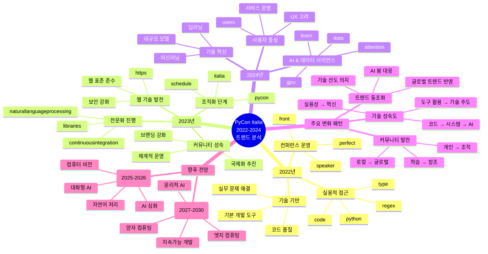

## 개요
# 작성자: 정준영(nomorefifa)
PyCon Italia는 이탈리아에서 개최되는 최대 규모의 Python 컨퍼런스로, 유럽 Python 커뮤니티의 기술 동향을 가장 잘 보여주는 이벤트 중 하나입니다. 본 분석에서는 2022년부터 2024년까지 3년간의 발표 영상을 TF-IDF 분석을 통해 키워드를 추출하고, 실제 영상 제목과 교차 분석하여 Python 생태계의 진화 과정을 심층적으로 분석했습니다.

## 연도별 주요 특징과 실제 발표 내용 분석

### 2022년: 실무 중심의 기초 다지기

**키워드 분석 결과:**
- `python` (5.59점), `code` (3.33점), `speaker` (3.52점)이 상위권
- `regex` (0.44점), `type` (0.44점) 등 기본 기술 요소 중시

**실제 발표 주제 분석:**
2022년의 발표 제목을 살펴보면 키워드 분석 결과와 정확히 일치하는 패턴을 발견할 수 있습니다:

- **코드 품질과 베스트 프랙티스**: "Best practices for good(ish) and clean(ish) code", "Automate cleaning code in few easy steps!"
- **기본 Python 기술**: "Write Any Python Program in One Line and Only Using Lambdas!", "Writing Faster Python 3"
- **정규표현식과 텍스트 처리**: "RegEx Strikes Back: Regular Expressions for Text Mining"
- **웹 개발 기초**: "Leaflet on steroids with Django", "REST In Peace - producing REST services"

이는 2022년 Python 커뮤니티가 견고한 기초 기술과 실무 역량 강화에 집중했음을 보여줍니다.

### 2023년: 조직화와 전문화의 원년

**키워드 분석 결과:**
- `pycon` (11.51점), `schedule` (9.27점), `italia` (4.82점)으로 컨퍼런스 자체에 대한 관심 급증
- `https` (9.51점), `continuousintegration` (0.41점) 등 인프라와 DevOps 관심 증가

**실제 발표 주제 분석:**
2023년은 기술적 성숙도와 함께 커뮤니티의 조직화가 두드러진 해였습니다:

- **AI와 머신러닝 등장**: "Let's do graph machine learning on Cloud", "Ensembles of GANs as a Data Augmentation Technique"
- **DevOps와 인프라**: "Write portable CI/CD pipelines using Python", "Celery on AWS ECS"
- **고급 Python 기술**: "Beyond Pandas: lightning fast in-memory dataframes with Polars", "The CPU in your browser: WebAssembly demystified"
- **커뮤니티 성장**: "Open Source Is Eating the World", "Altering lives with communities"

특히 우주비행사 사만사 크리스토포레티(Samantha Cristoforetti)와의 Q&A 세션은 컨퍼런스의 위상이 국제적으로 높아졌음을 보여줍니다.

### 2024년: AI 혁명과 기술 혁신의 정점

**키워드 분석 결과:**
- `data` (3.80점), `learn` (2.96점)로 데이터 사이언스와 머신러닝 관심 폭증
- `gpu` (0.48점), `attention` (0.48점) 등 딥러닝 관련 용어 등장
- `users` (0.48점)로 사용자 경험에 대한 관심 증가

**실제 발표 주제 분석:**
2024년은 AI 혁명이 본격화된 해로, 발표 제목에서도 이러한 트렌드가 명확히 드러납니다:

- **생성형 AI와 LLM**: "Embeddings, Transformers, RLHF: Three key ideas to understand ChatGPT", "Large Language Models for Devs", "RAGtime with Haystack! How to build a RAG with Haystack 2.0?"
- **고성능 컴퓨팅**: "From GPU-poor to data-rich: data quality practices for LLM fine-tuning", "Speeding up Whisper for speech recognition by 10x"
- **AI 윤리와 프라이버시**: "The European AI Act: a data scientist's perspective", "Is your model private?", "Beyond Bias: Crafting Fairness in Pythonic Machine Learning Systems"
- **첨단 기술 융합**: "AI on a Microbudget - Methods of Machine Learning Miniaturization", "Mirror, mirror: LLMs and the illusion of humanity"

## 기술 트렌드 진화 패턴

### 1. 웹 개발에서 AI로의 패러다임 전환

- **2022년**: Django, FastAPI, REST API 등 전통적인 웹 개발
- **2023년**: 클라우드, 마이크로서비스, DevOps로 확장
- **2024년**: LLM, RAG, Transformer 등 AI 중심으로 완전 전환

### 2. 데이터 처리 기술의 고도화

- **2022년**: "Data Visualization con Streamlit", 기본적인 데이터 시각화
- **2023년**: "Pandas on Steroids", "Beyond Pandas: lightning fast in-memory dataframes with Polars"
- **2024년**: "Solving Two Hard Problems in Computer Science Using Pandas", "functime: a next generation ML forecasting library"

### 3. 성능 최적화에 대한 지속적 관심

모든 연도에 걸쳐 성능 최적화는 핵심 주제였으나, 접근 방식이 진화했습니다:
- **2022년**: "Writing Faster Python 3" - 기본적인 Python 최적화
- **2023년**: "Speed up Python with hardware accelerators" - 하드웨어 가속 활용
- **2024년**: "FastAPI: Hitting the Performance Jackpot", "Myths and fairy tales around Python performance" - 프레임워크와 아키텍처 수준의 최적화

## 주목할 만한 발견사항

### 1. Rust의 부상
2023년부터 "Rust is easy", "Robyn: A fast async Python web framework with a Rust runtime" 등 Rust 관련 발표가 등장하기 시작하여, 2024년에는 "Rewrite everything in Rust?", "Crabs in Snakes!" 등으로 확산되었습니다.

### 2. 오픈소스 기여와 커뮤니티 의식 강화
- **2022년**: "Ideas, Visions and Reality: Looking back on 20 years of community work"
- **2023년**: "Open Source for the long-haul", "Do the magic with DevOps, Open Source"
- **2024년**: "503 days working full time on FOSS: lessons learned", "Many ways to be a Python contributor"

### 3. 실용성과 혁신의 균형
모든 연도에 걸쳐 실무적인 문제 해결("Don't rely on discipline", "Managing large-scale ML pipelines")과 혁신적 기술 탐구("Quantum" 접근법, "Generative AI") 사이의 균형을 유지했습니다.

## 향후 전망

### 단기 전망 (2025-2026)
2024년 트렌드를 바탕으로 다음과 같은 주제들이 부상할 것으로 예상됩니다:

- **멀티모달 AI**: 텍스트, 이미지, 음성을 통합한 AI 시스템
- **AI 거버넌스**: EU AI Act 이후 규제 준수와 윤리적 AI 개발
- **엣지 AI**: 경량화된 모델과 모바일/IoT 기기에서의 AI 실행
- **양자-AI 하이브리드**: 양자 컴퓨팅과 AI의 융합

### 중장기 전망 (2027-2030)
- **지속가능한 AI**: 탄소 중립적 AI 개발과 그린 컴퓨팅
- **자율형 AI 시스템**: 자가 학습하고 진화하는 AI 시스템
- **생체모방 컴퓨팅**: 뇌과학 기반의 새로운 컴퓨팅 패러다임
- **분산형 AI**: 블록체인과 탈중앙화 기술을 활용한 AI 민주화

## 결론

PyCon Italia 2022-2024 분석을 통해 Python 커뮤니티가 단순한 스크립팅 언어 사용자 그룹에서 AI 혁명을 주도하는 기술 커뮤니티로 진화했음을 확인할 수 있었습니다. 특히 2024년의 급격한 AI 중심 전환은 Python이 현대 AI 개발의 핵심 언어로 자리매김했음을 보여줍니다.

이탈리아 Python 커뮤니티는 실용성을 잃지 않으면서도 최첨단 기술을 적극적으로 수용하는 균형잡힌 성장을 보여주고 있으며, 이는 전 세계 Python 커뮤니티의 발전 방향을 예시하는 훌륭한 사례라 할 수 있습니다.

> ##### 분석 방법론
>
> 본 분석은 TF-IDF(Term Frequency-Inverse Document Frequency) 알고리즘을 사용하여 각 연도별 상위/하위 300개 키워드를 추출하고, 실제 발표 제목과의 분석을 통해 검증했습니다.
