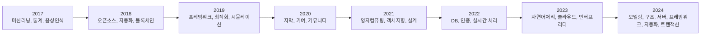
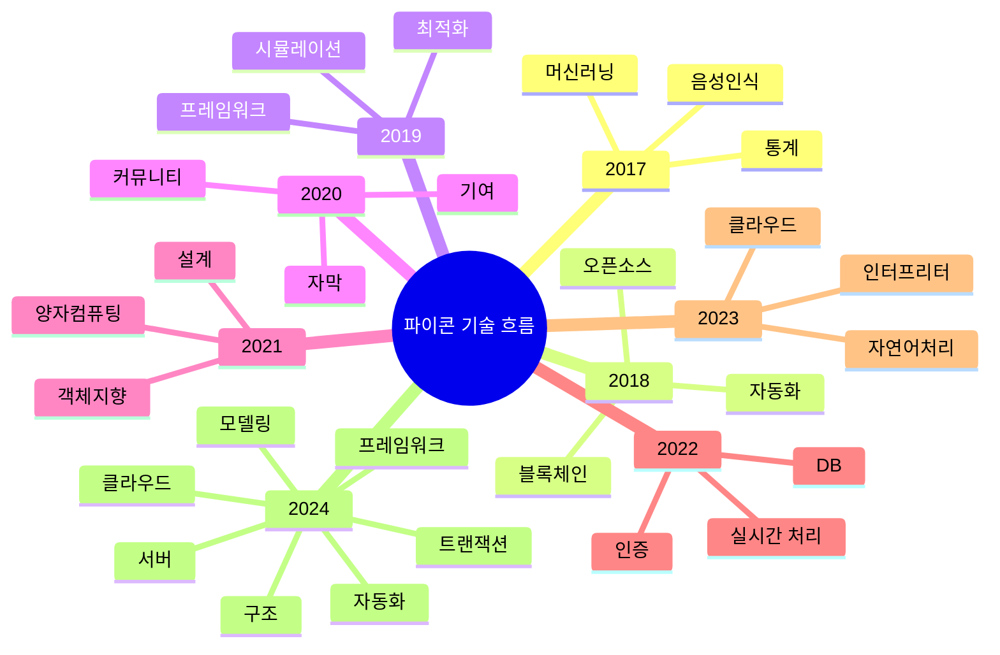

## 개요

2017년부터 2024년까지의 **파이콘 한국** 발표 영상에서 추출한 키워드 중 특히 기술 키워드를 기반으로 분석했습니다. 분석 결과를 통해 연도별 흐름을 정리하고, 머메이드(Mermaid) 다이어그램으로 시각화하여 트렌드를 파악하고자 했습니다.

---

## 분석 개요

- **분석 대상**: 파이콘 한국 발표 영상 (2017~2024)
- **분석 기법**: TF-IDF (Term Frequency - Inverse Document Frequency)
- **선별 기준**: 상위 300개 키워드 중 기술 관련 핵심어 추출
- **시각화 도구**: flowchart 및 Mermaid mindmap

---

## 연도별 기술 키워드 요약

| 연도   | 주요 키워드 |
|--------|-------------|
| 2017   | 머신러닝, 통계, 음성인식, 라이브러리 |
| 2018   | 오픈소스, 자동화, 블록체인, 테스트 |
| 2019   | 최적화, 프레임워크, 시뮬레이션 |
| 2020   | 자막, 커뮤니티, 기여, 프로그래밍 |
| 2021   | 객체지향, 설계, 양자컴퓨팅 |
| 2022   | 인증, 실시간 처리, DB, 자동화 |
| 2023   | 자연어처리, 인터프리터, 클라우드 |
| 2024   | 모델링, 구조, 서버, 구현, 프레임워크, 클라우드, 자동화, 트랜잭션 |

---
## 🔄 Flowchart: 연도별 흐름

## 🧠 Mindmap: 기술 키워드

---

## 📊 연도별 기술 인사이트 분석 (2017–2025) 
### [🌟 기술 트렌드 변화]

### 🔹 2017년: 기초 활용과 커뮤니티의 시작

- **핵심 키워드**: `발표`, `슬라이드`, `자료`, `파이썬`, `활용`, `개발`, `머신`, `러닝`, `구축`, `라이브러리`
- **인사이트**:
  - 발표 중심의 커뮤니티 교류와 학습 공유가 활발
  - `머신 러닝`, `데이터`, `통계`, `음성 인식`, `알고리즘` 키워드 등장 → 기술 입문자 및 데이터 중심 관심
  - `라이브러리`, `모델`, `시각화`, `테스트` 등 실무 연계된 Python 기반 실습 내용 포함

---

### 🔹 2018년: 오픈소스 확산과 자동화 기술 대두

- **핵심 키워드**: `토크`, `파이썬`, `오픈소스`, `자동화`, `라이브러리`, `분석`, `블록체인`, `네트워크`, `프로젝트`
- **인사이트**:
  - `오픈소스`, `공유`, `기여`, `리팩토링` 등 개발 문화 중심 흐름 강화
  - `자동화`, `서버`, `분포`, `컴파일러` → DevOps 및 인프라 자동화 초기 이슈 반영
  - `블록체인`, `인공 지능`, `지능`, `언어`, `모델`로 기술적 실험 확산

---

### 🔹 2019년: 실전 기술과 생산성 중심 전환

- **핵심 키워드**: `자료`, `코드`, `프로젝트`, `타입`, `최적화`, `문제`, `네트워크`, `라이브러리`, `자동`, `운영`
- **인사이트**:
  - `최적화`, `문서화`, `운영`, `자동`, `서비스` 등 실무 환경으로 관심 확장
  - `프레임워크`, `라우터`, `클래스`, `모듈` 등 구조화된 개발 기술 부각
  - `인터넷`, `API`, `서비스 운영` → 웹 기반 기술과 배포 구조 진입

---

### 🔹 2020년: 커뮤니티 중심 가치와 오픈 생태계 강조

- **핵심 키워드**: `이콘`, `비영리`, `자막`, `봉사`, `주관`, `생태계`, `기여`, `운영`, `튜토리얼`
- **인사이트**:
  - 기술보다 커뮤니티와 비영리 구조 강화된 흐름
  - `영상`, `컨퍼런스`, `자막`, `유튜브`, `운영자` 등 콘텐츠 접근성 중심 확장
  - 기술적 내용은 다소 적지만 `파이썬`, `커뮤니티`, `기여`, `세계`, `정보` 지속 강조

---

### 🔹 2022년: 복귀 후 실무 기술에 집중

- **핵심 키워드**: `리뷰`, `처리`, `전략`, `설계`, `학습`, `모바일`, `네트워크`, `컴퓨팅`, `마크다운`
- **인사이트**:
  - 팬데믹 이후 기술 중심 세션 복귀, `데이터베이스`, `컴퓨팅`, `처리`, `도전` 등 강화
  - `상속`, `클래스`, `설계`, `의사결정`, `구조` → 소프트웨어 아키텍처적 시각 강화
  - `리뷰`, `도전`, `여정` → 커리어 성찰과 공유도 병행

---

### 🔹 2023년: 효율 중심 실무 프레임워크의 확산

- **핵심 키워드**: `백엔드`, `자동화`, `패키지`, `환경`, `효율`, `기여`, `운영`, `배포`, `프론트엔드`, `러닝`
- **인사이트**:
  - `DevOps`, `백엔드`, `프론트엔드`, `배포`, `운영`, `자동화` → 엔지니어링 스택 통합
  - `패키지`, `프레임워크`, `스크립트`, `분산` → 복잡한 시스템 운영을 위한 도구 확산
  - `학습`, `도구`, `현업`, `협업`, `디자인` 등 실전 중심 세션 증가

---

### 🔹 2024년: 교사와 교육 기술, 클라우드 기반 실전 강조

- **핵심 키워드**: `파이썬`, `클라우드`, `구현`, `레포`, `모델링`, `채점`, `인터프리터`, `자동화`, `서버`
- **인사이트**:
  - `클라우드`, `트랜잭션`, `인터프리터`, `모델링`, `도구`, `프로젝트` 등 실전 기술 강조
  - `교사`, `초등`, `색칠`, `공룡시대`, `교육`, `정규`, `체험` → **코딩 교육과 STEAM 연계 확대**
  - `엔터프라이즈`, `자동화`, `프레임워크`, `커넥션`, `유저` → 대규모 서비스 확장 대응 키워드 부각

---

### 🔁 지속적으로 등장하는 키워드

- **기본 스택**
  - `파이썬`은 모든 해에 걸쳐 최상위 키워드로 등장하며, 사실상 주 언어로 자리 잡음
  - `개발`, `활용`, `코드`, `프로젝트`, `서비스`, `사용`, `공유` 등은 실무적 맥락에서 반복적으로 출현

- **기술 스택 흐름**
  - `머신러닝` → `오픈소스 자동화` → `최적화/프레임워크` → `자연어 처리/클라우드` → `트랜잭션/인터프리터`

---

### 🧩 결론 및 제언

- **트렌드 정리**
  - 파이콘 한국은 단순한 컨퍼런스를 넘어서, 연도별 기술 트렌드를 반영하는 중요한 자료로 활용 가능
  - 기술의 흐름은 초기에는 개념과 도입 중심, 중기에는 오픈소스와 커뮤니티 문화, 후기에는 실무 중심 기술로 진화

- **활용 방법**
  - **개발자**: 기술 스택 학습 방향을 과거 흐름에 기반하여 설정 가능
  - **교육자/조직**: 커리큘럼 및 기술 도입 전략 수립 시 연도별 흐름을 반영 가능
  - **신규 참가자**: 과거 키워드 분석을 통해 발표 주제 선정이나 트렌드 예측에 활용

> 📖 "기술은 사람을 향해 발전하고, 커뮤니티는 그 발전의 원동력이다."

---

