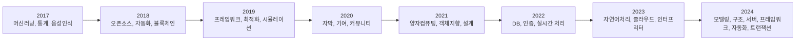
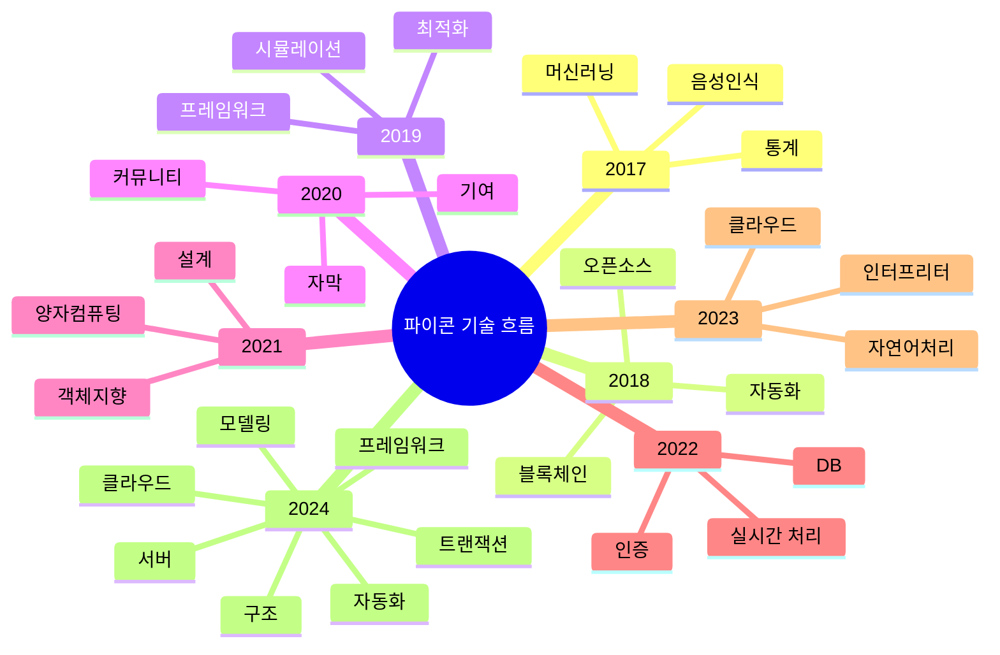

# 파이콘 기술 키워드 분석 보고서 (2017–2024)

* 작성자 : 최지수

## 🧭 개요

본 보고서는 2017년부터 2024년까지의 파이콘 한국 발표 영상에서 추출한 텍스트 데이터를 기반으로 TF-IDF (Term Frequency-Inverse Document Frequency) 분석을 수행하여, 연도별 기술 키워드의 흐름과 파이썬의 변화를 살펴봅니다.

TF-IDF 기반 상위 키워드를 선별하고, 기술 관련 키워드를 필터링하여 연도별 기술 주제를 도출하였으며, 결과는 Mermaid 다이어그램 및 표 형식으로 시각화해 기술 트렌드의 연속성과 변화를 직관적으로 파악할 수 있도록 구성했습니다.

- **분석 목적**: 파이콘 한국의 연도별 발표 콘텐츠로부터 Python 기반 기술 트렌드 변화를 분석
- **분석 방법**: 각 연도별 발표 영상 텍스트의 TF-IDF 가중치 기반 상위 키워드 추출 → 기술 관련 키워드 필터링 → 연도별 주요 기술 주제 도출  
- **분석 데이터**: 파이콘 한국 발표 영상 텍스트 (2017년 ~ 2024년)

---

## 연도별 기술 키워드 요약

| 연도   | 주요 키워드 |
|--------|-------------|
| 2017   | 머신러닝, 통계, 음성인식, 라이브러리 |
| 2018   | 오픈소스, 자동화, 블록체인, 테스트 |
| 2019   | 최적화, 프레임워크, 시뮬레이션 |
| 2020   | 자막, 커뮤니티, 기여, 프로그래밍 |
| 2021   | 객체지향, 설계, 양자컴퓨팅 |
| 2022   | 인증, 실시간 처리, DB, 자동화 |
| 2023   | 자연어처리, 인터프리터, 클라우드 |
| 2024   | 모델링, 구조, 서버, 구현, 프레임워크, 클라우드, 자동화, 트랜잭션 |

---
## 🔄 Flowchart: 연도별 흐름

## 🧠 Mindmap: 기술 키워드

---
---
## 🗓️ 연도별 상세 기술 트렌드 분석

### 🔹 2017년: 파이썬 기반 AI/ML 태동기
- **📊 핵심 키워드**: `발표`, `슬라이드`, `자료`, `파이썬`, `활용`, `머신러닝`, `데이터`, `분석`, `알고리즘`, `음성 인식`
- **🔬 주요 기술 분야**
  - 텍스트 및 한국어 처리
  - 기초 머신러닝과 데이터 분석
  - 음성 인식(Amazon Echo 사례 포함)
  - 기초 모델링 및 시각화
- **💡 특징 및 시사점**
  - 파이썬을 활용한 AI/ML 학습 수요 증가
  - 실생활 문제 적용 사례(음성인식, 챗봇 등)에 대한 관심 형성

---

### 🔹 2018년: 기술 다양화 및 오픈소스 확산
- **📊 핵심 키워드**: `오픈소스`, `공유`, `리팩토링`, `블록체인`, `자동화`, `개발`, `서버`, `네트워크`, `프로젝트`, `언어`
- **🔬 주요 기술 분야**
  - 오픈소스 생태계 및 기여문화 확산
  - 블록체인 기술 등장
  - 자동화 시스템 도입과 DevOps 논의
  - 러스트, 다양한 언어 도입
- **💡 특징 및 시사점**
  - 개발 문화의 변화(기여, 커뮤니티 중심)와 함께 기술 스펙트럼 확장
  - 실험적 기술 도입으로 전환기적 의미 지님

---

### 🔹 2019년: 최적화 중심 및 미래 기술 탐색
- **📊 핵심 키워드**: `최적화`, `라이브러리`, `프레임워크`, `운영`, `문서화`, `인터넷`, `라우터`, `API`, `자동`, `문제`
- **🔬 주요 기술 분야**
  - 성능 개선을 위한 코드 최적화
  - 프레임워크 중심의 구조적 개발 기술
  - 자연어 처리 강화
  - 양자 기술 등 미래 기술 탐색
- **💡 특징 및 시사점**
  - 실무 환경 적용을 위한 기술 구조화
  - 양자 기술 등장으로 미래 지향 기술의 실험이 시작됨

---

### 🔹 2020년: 커뮤니티 중심 및 인프라 기술 강화
- **📊 핵심 키워드**: `커뮤니티`, `비영리`, `운영`, `유튜브`, `튜토리얼`, `자막`, `컨퍼런스`, `기여`, `정보`
- **🔬 주요 기술 분야**
  - 쿠버네티스, 클러스터 기반 인프라 기술
  - 빅데이터 및 로봇공학 기술 사례
  - 콘텐츠 제작과 접근성 향상 (자막, 유튜브 활용)
- **💡 특징 및 시사점**
  - 팬데믹 영향으로 기술보다는 ‘커뮤니티 가치’와 비영리 정신이 전면에 부각
  - 실제 운영 환경에 필요한 기술 강조 시작

---

### 🔹 2022년: 전문화 및 고도 기술 도입
- **📊 핵심 키워드**: `양자컴퓨팅`, `처리`, `설계`, `의사결정`, `구조`, `클래스`, `도전`, `여정`, `컴퓨팅`
- **🔬 주요 기술 분야**
  - 양자컴퓨팅, 데이터베이스 고도화
  - 소프트웨어 아키텍처 설계
  - 실시간 데이터 처리 기술
  - 커리어 공유 및 기술 회고
- **💡 특징 및 시사점**
  - 전문 기술 심화와 함께 기술적 ‘구조적 사고’ 강조
  - 커리어 성찰형 세션(리뷰, 여정) 등장으로 발표 유형 확장

---

### 🔹 2023년: 프로덕션 중심 및 실무 기술 집중
- **📊 핵심 키워드**: `자동화`, `백엔드`, `분산`, `배포`, `프론트엔드`, `러스트`, `트레이딩`, `클라우드`, `세션`, `서비스`
- **🔬 주요 기술 분야**
  - DevOps 기반 자동화 시스템
  - 대규모 서비스 운영을 위한 클라우드 및 분산 구조
  - 금융/트레이딩 도메인 확장
  - 챗봇 기술 고도화 및 러스트 확산
- **💡 특징 및 시사점**
  - 실무 지향 기술이 중심이 되었으며, 프레임워크 활용 및 운영 자동화가 본격화됨
  - 산업 적용 중심으로 기술 스택이 다양화됨

---

### 🔹 2024년: 커뮤니티 회귀 및 구조적 사고
- **📊 핵심 키워드**: `파이썬`, `클라우드`, `구현`, `레포`, `채점`, `인터프리터`, `교육`, `STEAM`, `교사`, `구조`
- **🔬 주요 기술 분야**
  - 교육 기술(채점 시스템, 인터프리터 도구)
  - 클라우드 기반 구조 설계
  - 구조적 사고 및 커뮤니티 중심 논의
- **💡 특징 및 시사점**
  - 기술 중심에서 철학적·교육적 전환을 시도한 해
  - 기술의 ‘사회적 접점’과 커뮤니티의 가치 재조명
  - STEAM 교육 연계, 초등/중등 교육 기술 주제로 확장
 
---
---

## 🔔 기술 인사이트 요약표 (2017~2024)

| 연도       | 주요 기술 주제                             | 핵심 키워드 예시                                 | 트렌드 단계         | 시사점 요약 |
|------------|--------------------------------------------|--------------------------------------------------|----------------------|-------------|
| 2017       | 머신러닝 기초, 자연어처리, 음성인식        | 파이썬, 머신러닝, 데이터, 음성 인식              | 기초 탐색기          | 기술 입문과 커뮤니티 시작, 실용 AI 첫 소개 |
| 2018       | 오픈소스, 자동화, 블록체인, 리팩토링       | 오픈소스, 자동화, 공유, 블록체인, 언어           | 기초 탐색기          | 기술 다양화, DevOps 및 새로운 언어 실험 |
| 2019       | 코드 최적화, 프레임워크, 구조화           | 최적화, 프레임워크, 모듈, 운영, 라우터            | 최적화 추진기        | 실전 코드 품질 향상 및 구조 중심 개발 강화 |
| 2020       | 커뮤니티, 콘텐츠 접근성, 인프라 기술       | 커뮤니티, 유튜브, 기여, 쿠버네티스, 자막         | 최적화 추진기        | 팬데믹 이후 커뮤니티 가치 부각, 운영 인프라 관심 증가 |
| 2022       | 아키텍처, 양자컴퓨팅, 설계, 성찰           | 양자컴퓨팅, 설계, 의사결정, 리뷰, 클래스          | 전문화 심화기        | 고도 기술 심화와 커리어 회고 확산 |
| 2023       | 자동화, 백엔드, 트레이딩, 러스트 확산     | 자동화, 백엔드, 트레이딩, 분산, 러스트           | 전문화 심화기        | 프로덕션 중심 기술 고도화 및 산업 적용 강화 |
| 2024       | 교육 기술, 구조적 사고, STEAM, 커뮤니티   | 구조, 채점, 인터프리터, 교육, 클라우드           | 성찰 및 구조화기     | 사고와 가치 중심, 기술의 사회적 접근 강조 |

### 🔔 주요 기술 영역별 변화

| 기술 영역      | 2017–2018         | 2019–2020          | 2022–2023             | 2024                |
|---------------|-------------------|--------------------|------------------------|---------------------|
| AI/ML         | 기초 머신러닝     | 자연어처리 고도화 | 양자컴퓨팅, 챗봇       | 구조적 접근          |
| 인프라        | 네트워크 기초     | 쿠버네티스 도입   | 분산 시스템, 클라우드  | 클라우드 실무 확산   |
| 개발방법론    | 리팩토링 중심     | 최적화 기술        | 백엔드/DevOps 집중     | 사고와 관점 중심     |
| 신기술        | 블록체인          | 빅데이터           | 러스트, 트레이딩       | 구조적 해석 강조     |

### 🔁 반복적으로 등장한 핵심 키워드 및 기술 스택 흐름

- **공통 핵심 키워드**
  - `파이썬 (Python)` : 모든 연도에서 최상위 키워드로, 한국 기술 생태계의 중심 언어로 기능
  - `개발`, `코드`, `활용`, `공유`, `서비스`, `사용`, `구현`, `프로젝트`: 실무와 생산성 중심 흐름 반영
  - `자동화`, `분석`, `데이터`, `운영`: DevOps, 데이터 기반 개발 문화의 확산을 나타냄

- **기술 스택 흐름 요약**
  - `머신러닝` → `오픈소스 자동화` → `최적화/프레임워크` → `자연어 처리/클라우드` → `트랜잭션/인터프리터`

---    
    
## 🎯 결론 및 제언

### 💡 핵심 인사이트

- **파이썬 생태계의 성숙화**: 8년간 모든 기술 변화의 중심에 파이썬이 있었으며, 주요 언어로서의 위상을 유지함
- **실무 중심 진화**: 초기 학습 중심에서 실전 배포, 자동화, 프로덕션 기술로 전환됨
- **커뮤니티 가치의 순환**: 2020년과 2024년을 중심으로 기술과 사람, 커뮤니티 중심 가치가 재조명됨
- **기술 트렌드 선도성**: 블록체인, 양자컴퓨팅, 분산 시스템 등 미래 기술을 조기에 도입함

---

### 🚀 향후 전망

- **구조적 사고 기반 기술 방법론 강화**: 패턴 중심 개발, 교육 프로그래밍, 설계 기반 사고 확산 예상
- **AI 기술의 고도화와 실용화**: 챗봇, 자연어 처리, 트레이딩 등 분야별로 AI 활용이 구체화될 전망
- **인프라 기술의 심화**: 클라우드 네이티브, 대규모 분산 시스템, 자동화 툴 사용이 표준화될 가능성
- **커뮤니티 주도의 기술 생태계 강화**: 오픈소스, 자발적 기여, 교육 중심 커뮤니티 문화의 지속적 성장 기대

---

> 📖 "기술은 질문을 낳고, 커뮤니티는 해답을 찾는다."

*본 보고서는 파이콘 한국 2017~2024년 발표 영상 데이터의 TF-IDF 키워드 분석을 기반으로, Python 중심 기술 생태계의 흐름과 진화를 정리한 자료입니다.*

*[파이콘 한국]: https://pycon.kr*

