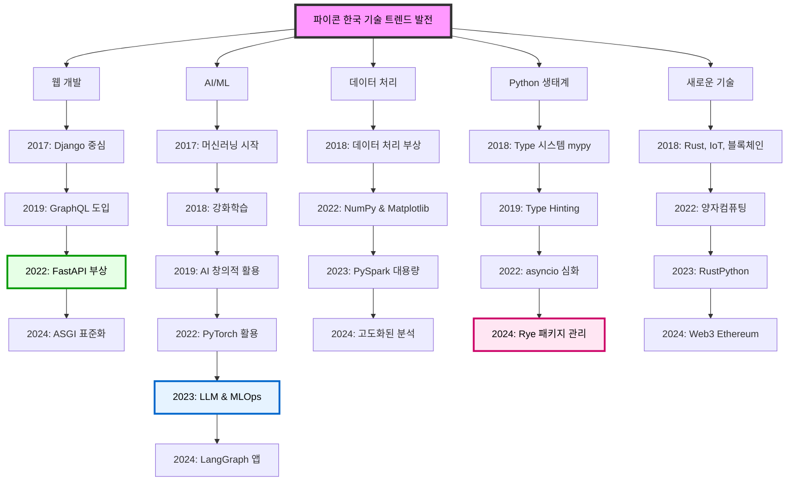

> ##### 요약
>
> 본 리포트는 2017년부터 2024년까지 파이콘 한국 발표 영상의 Top 300 키워드를 분석하여, 연도별 주요 기술 트렌드와 그 변화를 정리한 기술 동향 분석입니다.
{: .block-tip }

## 1. 개요

파이콘 한국은 국내 Python 개발자들이 기술을 공유하고 커뮤니티를 강화하는 대표적인 컨퍼런스입니다. 본 보고서는 2017년부터 2024년까지의 발표 영상에서 추출한 Top 300 키워드 중 기술 중심 단어를 선별하여, 연도별 기술 트렌드의 흐름을 요약합니다.

## 2. 연도별 주요 기술 키워드 및 간략 분석

### 2017년

- **주요 키워드**: python, django, aws, 머신러닝, pyqt, ansible, openstack, nltk, aiohttp, pytest
- **분석**: Python과 Django 중심의 웹 개발이 주요 관심사였고, AWS 및 머신러닝 관련 주제가 등장하기 시작했습니다. 테스트 자동화와 특정 라이브러리(PyQt, NLTK) 활용도 눈에 띕니다.

### 2018년

- **주요 키워드**: python, django, github, data, rust, iot, 블록체인, reinforcement learning, 3d, forensic
- **분석**: 실용적인 Python 활용, 데이터 처리와 테스트, 오픈소스 기여가 두드러졌습니다. Rust, IoT, 블록체인 등 새로운 기술에 대한 실험도 시작되었습니다.

### 2019년

- **주요 키워드**: type hinting, graphql, graphene, magenta, celery, api, cpython
- **분석**: Type Hinting과 GraphQL을 비롯한 API 기술이 주목받았고, AI의 창의적 활용 사례(Magenta) 및 비동기 처리에 대한 심화된 논의가 이어졌습니다.

### 2020년

- **주요 키워드**: boto3, aws, django, 크롤링, 오픈소스, 테스트
- **분석**: 코로나19로 인해 온라인 중심으로 전환되며 커뮤니티 관련 키워드가 증가했으나, 여전히 AWS, Django, 크롤링, 테스트 등 핵심 기술은 유지되었습니다.

### 2022년

- **주요 키워드**: type hinting, asyncio, sqlalchemy, fastapi, gil, 양자컴퓨팅, pytorch
- **분석**: Python 고급 주제들이 부각되며 FastAPI가 웹 프레임워크로 새롭게 부상했습니다. 양자컴퓨팅, PyTorch 등의 고급 주제도 일부 등장했습니다.

### 2023년

- **주요 키워드**: llm, mlops, serving, fastapi, pyspark, pandas, rustpython
- **분석**: AI 실전 운영(MLOps, Serving), 대규모 데이터 처리 기술(PySpark, Pandas)이 큰 비중을 차지하며, FastAPI와 실험적 기술(RustPython)도 소개되었습니다.

### 2024년 (데이터 제한적)

- **주요 키워드**: rye, pypencil, langgraph, pyo3, ethereum, fastapi, pytest
- **분석**: Rye(패키지 관리), LangGraph(LLM 기반 앱), PyO3(Rust-Python 인터페이스) 등 신기술 등장과 함께 FastAPI, Django의 인기가 이어졌습니다.

## 3. 종합 동향 요약

- **지속적인 강자**: Python, Django는 꾸준한 핵심 기술
- **AI/ML 발전**: 머신러닝 → 강화학습 → PyTorch → LLM, MLOps로 진화
- **웹 프레임워크의 다변화**: FastAPI가 Django를 보완하며 급부상
- **데이터 기술의 중요성**: pandas, numpy, pyspark 등 데이터 처리 기술 강화
- **Python 생태계 심화**: Type Hinting, asyncio, Rye 등 생산성 중심 도구 강화
- **신기술 도입**: Rust, 블록체인, Web3, 양자컴퓨팅 등 탐색 지속

## 4. 결론

파이콘 한국은 단순한 Python 행사에 그치지 않고, 시대 흐름을 반영하며 최신 기술을 적극적으로 공유하는 장으로 기능해왔습니다. 특히 AI/ML의 실전화, 웹 개발의 진화, Python 생태계의 성숙이 눈에 띄며, 개발자들의 실용적이면서도 미래 지향적인 관심이 꾸준히 이어지고 있음을 확인할 수 있습니다.

> ##### 참고
>
> 본 보고서의 키워드 데이터는 파이콘 한국 영상 및 발표 자료에 기반한 비공식 분석 결과이며, 기술 트렌드의 방향성을 가늠하는 용도로 활용하시기 바랍니다.
{: .block-tip }
