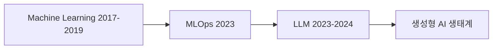
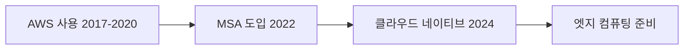
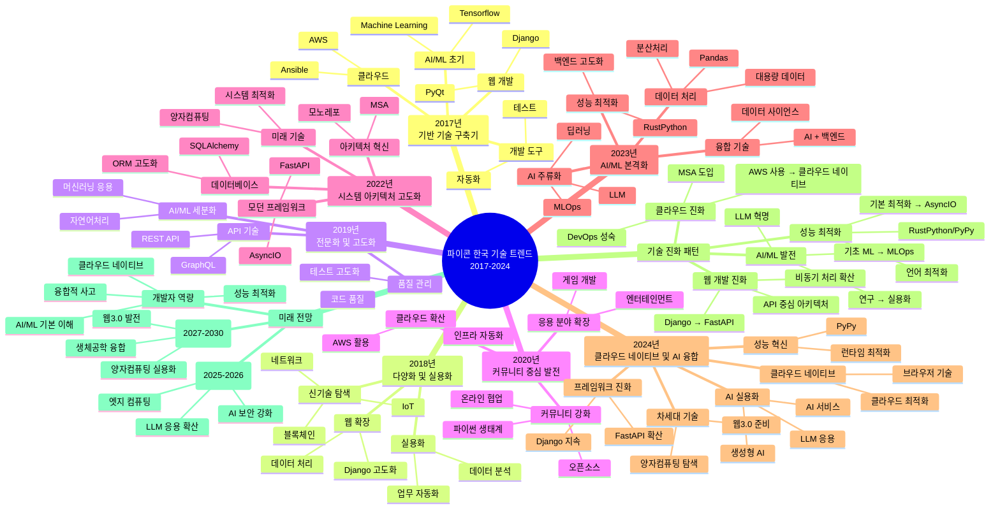

## PyCon Korea 기술 트렌드 (2017-2024)

**요약:**
PyCon Korea 컨퍼런스 발표 (2017-2024)는 한국의 활기차고 진화하는 파이썬 생태계를 보여줍니다. 주요 트렌드로는 **웹 개발**(특히 Django의 꾸준한 인기와 FastAPI의 부상), **데이터 과학, 머신러닝 및 AI**의 폭발적인 성장과 성숙(기초 개념에서 MLOps 및 최첨단 LLM/생성형 AI까지), **파이썬 내부 구조, 성능 및 비동기 프로그래밍**에 대한 지속적인 관심, 그리고 **최신 개발 도구 및 관행**(패키징, 테스트, CI/CD, 컨테이너)의 중요성 증대 등이 있습니다. **교육 분야에서의 파이썬 활용**과 **커뮤니티 구축**은 여전히 중요한 축을 담당하고 있습니다. 최근에는 **Rust와의 통합**, 브라우저 측 파이썬을 위한 **WebAssembly(WASM) 채택**, 그리고 **보안** 및 **엔터프라이즈 파이썬**에 대한 관심이 두드러집니다.

**방법론:**
본 보고서는 PyCon Korea 발표 제목 및 설명을 분석한 결과를 기반으로 합니다. 각 연도별 키워드와 주제를 추출하여 시간 경과에 따른 출현, 지속성 및 진화 과정을 추적했습니다.

---

**I. 주요 및 진화하는 주제:**

1.  **웹 개발:**
    *   **Django:** 모든 연도에 걸쳐 핵심적인 프레임워크입니다. 발표 내용은 ORM 심층 분석(2018, 2020, 2022, 2023), 성능 최적화(2019), 다중 사이트 아키텍처(2019), 데이터베이스 라우팅(2019), 레거시 시스템과의 통합(2018), 실시간 기능을 위한 Channels(2018), 보안(2022, 2024), 버전 업그레이드(2022, 2024), 그리고 GraphQL/Relay와 같은 최신 프론트엔드 접근 방식과의 결합(2019, 2022, 2023) 등을 다룹니다.
    *   **Flask:** 등장하지만, Django만큼 자주 언급되지는 않았습니다.
    *   **비동기 웹 프레임워크 (FastAPI, Sanic, aiohttp):**
        *   `aiohttp`와 `Sanic`은 초기부터 등장했습니다(예: 2018년 마이크로서비스 및 추천 시스템용 Sanic, 2017년 프로덕션 환경의 aiohttp).
        *   **FastAPI**는 2022-2024년경부터 상당한 주목을 받으며, 학습 방법(2022), 심층 분석(2023), 의존성 주입과 함께 사용(2024) 등의 발표가 있었습니다.
    *   **마이크로서비스 & API:** gRPC(2019, 2020), GraphQL(2019년 Graphene, 2022년 및 2023년 Django와 함께 사용), REST API 문서화(2019), 일반적인 마이크로서비스 아키텍처 논의(2018, 2022).
    *   **서버리스:** 웹 서비스(2022) 및 주피터 노트북과 같은 특정 애플리케이션(2022)에 대해 언급되었습니다.

2.  **데이터 과학, 머신러닝 & AI:**
    *   **기초 (초기 2017-2019):** Pandas, NumPy, Scikit-learn이 데이터 처리, 분석 및 기본 ML을 위해 자주 언급되었습니다. 주제로는 데이터 정제/특성 공학(2018), 효율적인 Pandas 사용법(2019), NLP 기초(2017, 2019 - 예: 띄어쓰기), 추천 시스템(2018, 2019), 이미지 분석 등이 있습니다.
    *   **딥러닝 (점진적 부상 2018-2020):** TensorFlow와 PyTorch가 더 눈에 띄게 등장합니다. 응용 분야로는 게임 AI(2018), 소설 창작(2018), 이미지 인식(2019), 음성 인식(2020), BERT(2019, 2020) 및 ALBERT(2020)와 같은 NLP 모델이 포함됩니다. 강화 학습도 특징적입니다(2018).
    *   **대규모 데이터 & 분산 컴퓨팅 (2019-2023):**
        *   대규모 데이터셋 처리를 위한 `Dask` 및 `Spark`(종종 `Koalas` 또는 `PySpark`와 같은 파이썬 인터페이스와 함께 사용) (2019, 2020, 2023).
        *   Pandas 2.0 및 Apache Arrow와의 통합, 효율적인 로컬 대용량 데이터 처리를 위한 `Polars` 및 `DuckDB`와 같은 도구 (2023).
    *   **MLOps & 프로덕션화 (관심 증대 2019-2024):**
        *   모델 서빙 아키텍처(BentoML 2023), ML을 위한 컨테이너화(2019), 자동화된 워크플로우, MLOps를 위한 디자인 패턴(2023).
        *   데이터 엔지니어링 파이프라인에 대한 집중 (Luigi 2018, 일반 데이터 엔지니어링 2022).
    *   **LLM & 생성형 AI (2023-2024년부터 폭발적 증가):** 대규모 언어 모델, 생성형 AI 앱 개발(Google Cloud 2023), LangChain(2023, 2024) 및 다양한 도메인에 걸친 실제 응용 프로그램 관련 주제가 급증했습니다.
    *   **특수 응용 분야:** 퀀트 트레이딩/금융(2020, 2023, 2024), 법률 데이터 분석(2018, 2019, 2020), 의료 AI(2018, 2019), 생명정보학(2023 - 장혜식 기조연설).

3.  **파이썬 내부 구조, 성능 & 동시성:**
    *   **Asyncio & 코루틴:** 일관된 주제입니다. `asyncio` 기초에 대한 초기 발표(2018 - 코루틴 심층 분석, Callosum)는 "실전 asyncio"(2019), `asyncio` 라이브러리 작동 방식 이해(2022), 고급 디버깅(2023 - aiomonitor-ng), `SQLAlchemy와 asyncio`(2022) 등으로 진화했습니다.
    *   **GIL (Global Interpreter Lock):** GIL 이해에 대한 심층 분석(2022).
    *   **CPython 내부 구조:** CPython 수정(예: 2018년 switch문 추가), 성능 개선 이해(2019년 Python 3.7), 일반적인 CPython 구조(2024)에 대한 발표.
    *   **성능 최적화:** 일반적인 파이썬다운 코드 효율성(2018), 내장 자료형의 시간 복잡도(2019), 테스트 시간 단축(2019), 효율적인 Pandas(2019, 2023).
    *   **메모리 관리 & 직렬화:** Pickle(2019), 커스텀 바이너리 직렬 변환기(2019), 효율적인 데이터 타입 사용(2019).
    *   **병렬 처리:** 파이썬에서의 병렬 처리 기법에 대한 일반적인 논의(2023).

4.  **개발 도구, 관행 & DevOps:**
    *   **테스팅:** `pytest`(2017, 2019, 2024), 고급 테스팅 기법(BDD, 모킹, 무작위 테스팅 2019), TDD(2020), 테스트 실행 시간 단축(2019).
    *   **패키징 & 의존성 관리:** `setup.py` 및 PyPI(2018), 잘 구성된 패키지에 대한 논의(2020), 의존성 문제 해결(2020), 그리고 `Poetry`(2023), `Nix`(2023), `Rye`(2024)와 같은 최신 도구로의 상당한 전환.
    *   **정적 타이핑:** `mypy` 및 타입 어노테이션은 2019년부터 중요성이 커졌으며, 기본 사용법(2019)에서 고급 응용(2022, 2023 - 예: DB, 호출 그래프 분석)까지 발표가 있었습니다.
    *   **CI/CD & 자동화:** Travis CI(2017), GitHub Actions(2024), Ansible(2017), 정적 사이트를 위한 일반적인 DevOps(2020).
    *   **컨테이너 & 오케스트레이션:** Docker(2017), Kubernetes(컨텍스트 내 언급, 예: 2019년 "쿠버네티스에 개들을 풀어라" LT).
    *   **버전 관리 & 협업:** 코드 리뷰 팁(2019), 일반적인 오픈소스 협업.
    *   **모노레포:** `Pantsbuild`(2022, 2023), `Rye`(2024).

5.  **교육 및 커뮤니티에서의 파이썬:**
    *   **교육:** 송석리 연사(2018, 2019, 2020 기조연설, 2022) 등이 주도하는 매우 강력한 반복 주제입니다. 교사, 학생(K-12, 대학), 비전공자를 위한 파이썬 교육과 교육에서의 미래 인식에 대한 우려(2023)를 다룹니다.
    *   **커뮤니티 구축:** PyLadies, Women Who Code(2018), 지역 파이썬 커뮤니티 성장(2018 - Manoj Pandey), PyCon 다양성(2018), 오픈소스 기여(2017, 2023), PyCon Korea 자체의 역사/정신에 대한 발표.
    *   **라이트닝 토크:** 다양한 소규모 프로젝트, 아이디어, 커뮤니티 공지를 보여주는 일관된 특징입니다.

**II. 신흥 분야 및 틈새 주제:**

1.  **Rust & 파이썬 통합:**
    *   초기 블록체인을 위한 Python + Rust 언급(2018).
    *   `RustPython`(2023), 바인딩을 위한 `PyO3`(2023, 2024), 그리고 `Ruff`(2023년 RustPython과 함께 언급) 및 `Rye`(2024)와 같이 Rust로 구축되어 파이썬 생태계에 영향을 미치는 도구들에 대한 발표로 크게 성장했습니다.

2.  **WebAssembly (WASM) & 브라우저 내 파이썬:**
    *   2020년경 관심 등장 (과학을 위한 Pyodide).
    *   브라우저 내 파이썬, PyScript, 게임을 위한 WASM에 대한 보다 명시적인 발표 (2024).

3.  **블록체인 & Web3:**
    *   초기 관심 (2018 - Python & Rust feat. 블록체인, 커스텀 블록체인 IoT).
    *   주춤하는 듯하다가 이더리움 상호작용을 위한 `web3.py`(2024) 및 일반 암호화폐 논의(2024)로 다시 부상했습니다.

4.  **사물 인터넷 (IoT):**
    *   MicroPython, PyBoard, 홈 자동화를 위한 Raspberry Pi(2018), IoT 장치에서의 이미지 분류(2019), MQTT/MicroPython 프로젝트(2024)에 대한 발표로 꾸준하지만 작은 규모로 존재합니다.

5.  **양자 컴퓨팅:**
    *   양자 시뮬레이션 및 알고리즘을 위한 파이썬(Qiskit) 사용에 대한 발표(2019, 2022)로 틈새 시장이지만 반복적으로 등장합니다.

6.  **보안:**
    *   초기 언급 (디지털 포렌식 2018).
    *   웹 애플리케이션 보안(BWASP 2022), Django 보안(ReBAC 2022, 해커의 관점 2024), SDLC에서의 보안을 위한 AI 통합(2024)에 대한 발표로 더욱 명확해졌습니다.

7.  **특정 도메인 애플리케이션:**
    *   **법률 기술:** 법률 데이터 분석, 법률 디버깅 (2018, 2019, 2020).
    *   **그래픽 & 게임:** Maya를 사용한 3D 그래픽(2018), 비주얼 노벨을 위한 Ren'Py(2022), Blender 파이프라인(2022).
    *   **자동화:** 엑셀 자동화(2018), 아래아 한글 자동화(2019, 2023), 일반 사무/CLI 자동화.

**III. 연도별 스냅샷 & 변화:**

*   **2017-2018 (기반 및 다양성):** 광범위한 파이썬 응용 분야. 비동기, 딥러닝, 데이터 파이프라인에 대한 초기 시도. 교육 및 커뮤니티에 대한 강한 집중. Django가 지배적이었습니다.
*   **2019 (성숙 및 심층 탐구):** Django, asyncio, 성능에 대한 더 고급 주제. BERT를 사용한 NLP 등장. 정적 타이핑(mypy) 및 최신 테스팅 관행 가시화. 대규모 데이터를 위한 Spark/Dask.
*   **2020 (적응 및 전문화 - 온라인):** COVID-19로 인한 전환. 지속적인 ML/NLP 발전. WebAssembly 등장. 패키징 및 의존성 관리가 주요 주제.
*   **2022 (재참여 및 현대화):** 대면 행사로 복귀. FastAPI가 강력한 경쟁자로 부상. 타이핑과 MLOps가 주류로 자리 잡음. Rust 통합 시작. 보안 주제가 더 직접적으로 다뤄짐.
*   **2023 (AI 폭발 및 도구 르네상스):** LLM 및 생성형 AI가 새로운 AI 발표를 지배. 고급 의존성 관리(Poetry, Nix) 및 빌드 도구(Pantsbuild)가 핵심. 성능 향상을 위한 Pandas 2.0 및 대안 데이터프레임(Polars, DuckDB) 논의. Rust/Python 상호 운용성 지속 성장.
*   **2024 (응용 AI 및 생태계 통합):** LLM이 광범위하게 적용됨. Rust 통합(Rye, PyO3) 및 브라우저 파이썬을 위한 WASM 확립. 보안, 엔터프라이즈 파이썬, 고급 Django 주제가 두드러짐. 교육은 여전히 중요한 논의 주제.

**IV. 전반적인 관찰 및 향후 전망:**

*   **파이썬의 다재다능함:** PyCon Korea는 웹 개발, 데이터 과학, 자동화, 교육 등에서 탁월한 범용 언어로서의 파이썬의 강점을 지속적으로 강조합니다.
*   **빠른 AI 진화:** PyCon Korea 내 AI 환경은 기초 ML에서 정교한 DL, MLOps, 그리고 현재 LLM/생성형 AI로 이동하는 글로벌 트렌드를 반영합니다.
*   **성능에 대한 인식:** 비동기 프로그래밍, 내부 구조 이해, Rust와 같은 빠른 언어와의 통합을 통해 파이썬의 성능 한계를 뛰어넘으려는 지속적인 노력이 있습니다.
*   **도구의 정교화:** 커뮤니티는 의존성 관리, 패키징, 테스팅, 개발 환경을 위한 더 고급 도구를 적극적으로 채택하고 논의하며, 이는 성숙해가는 생태계를 나타냅니다.
*   **커뮤니티와 교육이라는 핵심 가치:** 이는 PyCon Korea의 중심에 있으며, 성장, 포용성, 지식 공유를 촉진합니다.
*   **새로운 패러다임 수용:** 한국 파이썬 커뮤니티는 성능이 중요한 부분에 Rust를 사용하거나, 새로운 배포 대상을 위해 WASM을 사용하고, 고급 AI 모델을 통합하는 등 신흥 기술을 빠르게 탐색하고 통합합니다.

---


다음은 파이콘 한국의 발표 데이터를 TF-IDF 키워드 분석을 통해 살펴본 결과입니다. 

## 📊 연도별 기술 트렌드 분석

### 2017-2018년: 기반 기술 구축과 다양화 시기

2017-2018년은 **Django** 중심의 웹 개발이 주류였습니다. 이 시기의 주요 키워드들을 살펴보면:

- **웹 프레임워크**: Django, PyQt
- **클라우드 인프라**: AWS, Ansible  
- **신기술 탐색**: 블록체인, IoT, 머신러닝

```yaml
# 2017-2018년 주요 기술 스택
web_framework: Django
cloud_platform: AWS
automation: Ansible
emerging_tech: [blockchain, iot, machine_learning]
```

> ##### 인사이트
>
> 이 시기는 파이썬이 웹 개발을 넘어 다양한 분야로 확장되기 시작한 전환점이었습니다.
{: .block-tip }

### 2019-2020년: 전문화와 커뮤니티 성장

2019년부터는 기술의 **전문화**가 두드러지기 시작했습니다:

- **API 기술**: GraphQL 도입으로 API 설계 고도화
- **AI/ML**: 자연어처리 등 응용 분야 세분화
- **품질 관리**: 테스트 및 코드 품질에 대한 관심 증가

2020년은 코로나19의 영향으로 **오픈소스 커뮤니티 협업**이 크게 강화된 해였습니다.

### 2022년: 아키텍처 혁신의 해

2022년은 파이썬 생태계에 변화가 일어난 해입니다:

- **FastAPI** 등장으로 모던 웹 프레임워크 시대 개막
- **AsyncIO** 비동기 프로그래밍 본격 도입
- **MSA**(마이크로서비스 아키텍처) 전환 트렌드
- **양자컴퓨팅** 등 미래 기술 탐색 시작

```python
# 2022년 기술 스택 변화
old_stack = ["Django", "동기처리", "모놀리스"]
new_stack = ["FastAPI", "AsyncIO", "MSA"]
print(f"기술 스택 진화: {old_stack} → {new_stack}")
```

### 2023-2024년: AI/ML 혁명과 융합 기술

최근 2년간은 **AI/ML 기술의 폭발적 성장**이 특징입니다:

#### 2023년 - AI 주류화
- **LLM**(대규모 언어모델) 기술 본격 도입
- **MLOps** 운영 체계화로 ML 시스템 성숙
- **RustPython** 등 성능 최적화 기술 주목

#### 2024년 - 융합 기술 혁신
- **LLM 실용화** 및 응용 서비스 확산
- **클라우드 네이티브** 개발 패러다임 정착
- **AI + 웹** 기술 융합 가속화

## 🔄 기술 진화 패턴

파이콘 한국 데이터를 통해 확인된 주요 기술 진화 패턴은 다음과 같습니다:

### 웹 개발 프레임워크 진화


### AI/ML 기술 발전 궤적


### 클라우드 기술 진화


## 🚀 미래 전망과 개발자 가이드

### 단기 전망 (2025-2026)
1. **LLM 응용 기술 확산**: RAG, 파인튜닝, 멀티모달 AI
2. **엣지 컴퓨팅**: IoT 및 실시간 처리 요구 증가  
3. **AI 보안**: 새로운 보안 패러다임 필요

### 중장기 전망 (2027-2030)
1. **양자컴퓨팅 실용화**: 현재 탐색에서 실용 기술로
2. **웹3.0 발전**: 탈중앙화 기술의 재부상
3. **생체공학 융합**: 학제간 융합 기술 가속화

### 개발자를 위한 학습 로드맵

```yaml
# 필수 학습 영역
core_skills:
  - ai_ml: "LLM 기초, MLOps 이해"
  - cloud_native: "컨테이너화, 마이크로서비스"
  - async_programming: "AsyncIO, 비동기 패턴"
  - performance: "언어 최적화, 성능 튜닝"

# 권장 학습 순서
learning_path:
  1. "기존 Django/Flask 스킬 고도화"
  2. "FastAPI + AsyncIO 마스터"
  3. "AI/ML 기초 및 MLOps 이해"
  4. "클라우드 네이티브 아키텍처"
  5. "성능 최적화 및 언어 내부 이해"
```

> ##### 개발자 팁
>
> AI 시대에도 기본기가 중요합니다. 탄탄한 웹 개발 실력을 바탕으로 AI/ML 기술을 점진적으로 습득하는 것이 효과적입니다.
{: .block-tip }

## 📈 데이터로 본 인사이트

TF-IDF 분석 결과에서 발견한 흥미로운 패턴들:

1. **Django의 지속적 존재감**: 2017년부터 2024년까지 꾸준한 상위 키워드
2. **FastAPI의 급부상**: 2022년 등장 후 빠른 성장세
3. **AI 키워드 폭증**: 2023년 이후 LLM, MLOps 등 AI 관련 키워드 급증
4. **성능 최적화 트렌드**: AsyncIO → RustPython → PyPy로 이어지는 성능 추구

## 🎯 결론

파이콘 한국의 8년간 데이터 분석을 통해 확인한 것은 **파이썬 생태계의 놀라운 적응력과 진화 능력**입니다. 웹 개발 도구로 시작된 파이썬이 현재는 AI/ML, 클라우드, 시스템 최적화를 아우르는 종합 플랫폼으로 자리잡았습니다.

앞으로 파이썬 개발자들은 단일 분야 전문가에서 **융합형 개발자**로 발전해야 할 것입니다. 전통적인 웹 개발 역량에 AI/ML 이해력, 클라우드 네이티브 사고, 성능 최적화 능력을 갖춘 개발자가 차세대 기술 혁신을 이끌어갈 것으로 전망됩니다.

---

*이 분석은 파이콘 한국 2017-2024년 발표 데이터의 TF-IDF 키워드 분석을 바탕으로 작성되었습니다. *

[파이콘 한국]: https://pycon.kr
[TF-IDF]: https://en.wikipedia.org/wiki/Tf%E2%80%93idf
[Django]: https://www.djangoproject.com
[FastAPI]: https://fastapi.tiangolo.com
[MLOps]: https://ml-ops.org



