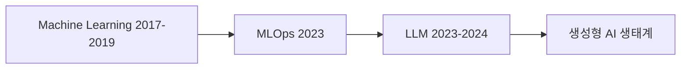
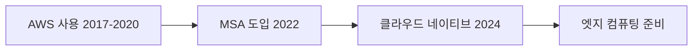
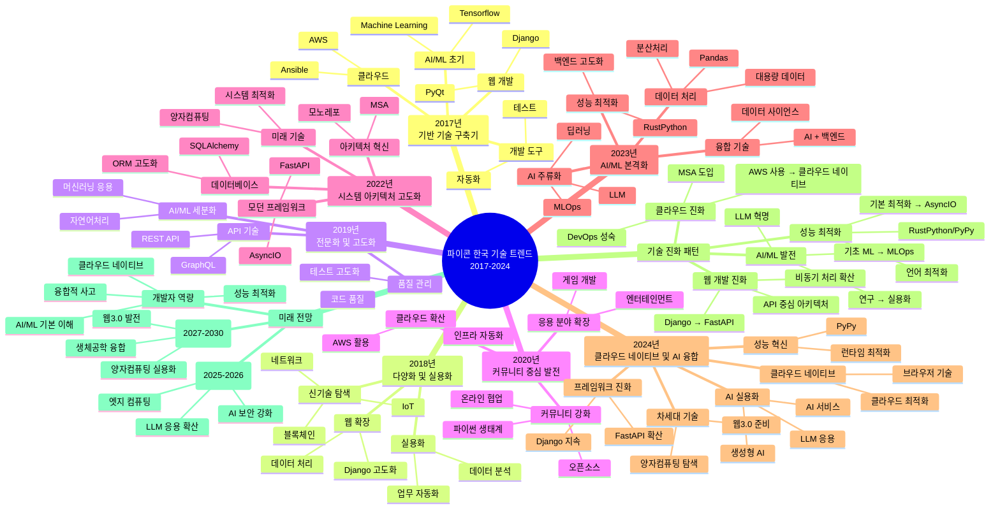

파이콘 한국의 발표 데이터를 TF-IDF 키워드 분석을 통해 살펴본 결과입니다. 
단순한 웹 개발 도구에서 AI/ML, 클라우드, 시스템 최적화를 아우르는 종합 플랫폼으로 발전한 과정을 데이터로 확인할 수 있었습니다.

## 📊 연도별 기술 트렌드 분석

### 2017-2018년: 기반 기술 구축과 다양화 시기

2017-2018년은 **Django** 중심의 웹 개발이 주류였습니다. 이 시기의 주요 키워드들을 살펴보면:

- **웹 프레임워크**: Django, PyQt
- **클라우드 인프라**: AWS, Ansible  
- **신기술 탐색**: 블록체인, IoT, 머신러닝

```yaml
# 2017-2018년 주요 기술 스택
web_framework: Django
cloud_platform: AWS
automation: Ansible
emerging_tech: [blockchain, iot, machine_learning]
```

> ##### 인사이트
>
> 이 시기는 파이썬이 웹 개발을 넘어 다양한 분야로 확장되기 시작한 전환점이었습니다.
{: .block-tip }

### 2019-2020년: 전문화와 커뮤니티 성장

2019년부터는 기술의 **전문화**가 두드러지기 시작했습니다:

- **API 기술**: GraphQL 도입으로 API 설계 고도화
- **AI/ML**: 자연어처리 등 응용 분야 세분화
- **품질 관리**: 테스트 및 코드 품질에 대한 관심 증가

2020년은 코로나19의 영향으로 **오픈소스 커뮤니티 협업**이 크게 강화된 해였습니다.

### 2022년: 아키텍처 혁신의 해

2022년은 파이썬 생태계에 변화가 일어난 해입니다:

- **FastAPI** 등장으로 모던 웹 프레임워크 시대 개막
- **AsyncIO** 비동기 프로그래밍 본격 도입
- **MSA**(마이크로서비스 아키텍처) 전환 트렌드
- **양자컴퓨팅** 등 미래 기술 탐색 시작

```python
# 2022년 기술 스택 변화
old_stack = ["Django", "동기처리", "모놀리스"]
new_stack = ["FastAPI", "AsyncIO", "MSA"]
print(f"기술 스택 진화: {old_stack} → {new_stack}")
```

### 2023-2024년: AI/ML 혁명과 융합 기술

최근 2년간은 **AI/ML 기술의 폭발적 성장**이 특징입니다:

#### 2023년 - AI 주류화
- **LLM**(대규모 언어모델) 기술 본격 도입
- **MLOps** 운영 체계화로 ML 시스템 성숙
- **RustPython** 등 성능 최적화 기술 주목

#### 2024년 - 융합 기술 혁신
- **LLM 실용화** 및 응용 서비스 확산
- **클라우드 네이티브** 개발 패러다임 정착
- **AI + 웹** 기술 융합 가속화

## 🔄 기술 진화 패턴

파이콘 한국 데이터를 통해 확인된 주요 기술 진화 패턴은 다음과 같습니다:

### 웹 개발 프레임워크 진화


### AI/ML 기술 발전 궤적


### 클라우드 기술 진화


## 🚀 미래 전망과 개발자 가이드

### 단기 전망 (2025-2026)
1. **LLM 응용 기술 확산**: RAG, 파인튜닝, 멀티모달 AI
2. **엣지 컴퓨팅**: IoT 및 실시간 처리 요구 증가  
3. **AI 보안**: 새로운 보안 패러다임 필요

### 중장기 전망 (2027-2030)
1. **양자컴퓨팅 실용화**: 현재 탐색에서 실용 기술로
2. **웹3.0 발전**: 탈중앙화 기술의 재부상
3. **생체공학 융합**: 학제간 융합 기술 가속화

### 개발자를 위한 학습 로드맵

```yaml
# 필수 학습 영역
core_skills:
  - ai_ml: "LLM 기초, MLOps 이해"
  - cloud_native: "컨테이너화, 마이크로서비스"
  - async_programming: "AsyncIO, 비동기 패턴"
  - performance: "언어 최적화, 성능 튜닝"

# 권장 학습 순서
learning_path:
  1. "기존 Django/Flask 스킬 고도화"
  2. "FastAPI + AsyncIO 마스터"
  3. "AI/ML 기초 및 MLOps 이해"
  4. "클라우드 네이티브 아키텍처"
  5. "성능 최적화 및 언어 내부 이해"
```

> ##### 개발자 팁
>
> AI 시대에도 기본기가 중요합니다. 탄탄한 웹 개발 실력을 바탕으로 AI/ML 기술을 점진적으로 습득하는 것이 효과적입니다.
{: .block-tip }

## 📈 데이터로 본 인사이트

TF-IDF 분석 결과에서 발견한 흥미로운 패턴들:

1. **Django의 지속적 존재감**: 2017년부터 2024년까지 꾸준한 상위 키워드
2. **FastAPI의 급부상**: 2022년 등장 후 빠른 성장세
3. **AI 키워드 폭증**: 2023년 이후 LLM, MLOps 등 AI 관련 키워드 급증
4. **성능 최적화 트렌드**: AsyncIO → RustPython → PyPy로 이어지는 성능 추구

## 🎯 결론

파이콘 한국의 8년간 데이터 분석을 통해 확인한 것은 **파이썬 생태계의 놀라운 적응력과 진화 능력**입니다. 웹 개발 도구로 시작된 파이썬이 현재는 AI/ML, 클라우드, 시스템 최적화를 아우르는 종합 플랫폼으로 자리잡았습니다.

앞으로 파이썬 개발자들은 단일 분야 전문가에서 **융합형 개발자**로 발전해야 할 것입니다. 전통적인 웹 개발 역량에 AI/ML 이해력, 클라우드 네이티브 사고, 성능 최적화 능력을 갖춘 개발자가 차세대 기술 혁신을 이끌어갈 것으로 전망됩니다.

---

*이 분석은 파이콘 한국 2017-2024년 발표 데이터의 TF-IDF 키워드 분석을 바탕으로 작성되었습니다. *

[파이콘 한국]: https://pycon.kr
[TF-IDF]: https://en.wikipedia.org/wiki/Tf%E2%80%93idf
[Django]: https://www.djangoproject.com
[FastAPI]: https://fastapi.tiangolo.com
[MLOps]: https://ml-ops.org



