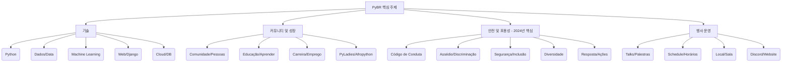

본 보고서는 PyCon Brazil(PyBR)의 2017년부터 2024년까지의 행사 관련 데이터를 분석하여 브라질 파이썬 커뮤니티의 발전 양상, 기술 트렌드, 그리고 주요 관심사를 파악하고자 합니다. 분석은 주로 공개된 행사 영상의 조회수 및 좋아요수 상위 목록과 각 연도별 행사 제목, 설명, 그리고 일부 발표 스크립트에서 추출된 키워드를 기반으로 수행되었습니다.

# 📈 **분석 결과 요약**

*   **발표 관심사 분석 (2017-2018년 데이터 중심):** 초기 데이터에서는 특정 기술 시연, AI/ML 관련 알고리즘, 커리어 개발, 그리고 모바일 개발 등 실용적이고 흥미로운 주제가 높은 관심을 받았습니다.
*   **기술 트렌드 분석:** 여러 연도에 걸쳐 **핵심 파이썬 기술(Django, 웹 개발, API 등)과 함께 데이터 과학, 머신러닝, 인공지능 분야가 강력하게 부상**했으며, 클라우드 및 데브옵스 관련 주제도 꾸준히 중요하게 다루어졌습니다.
*   **커뮤니티 및 문화적 동향:** PyBR은 기술 교류를 넘어선 커뮤니티 행사로서, **교육, 커리어 개발, 다양한 배경의 사람들을 위한 포용성 및 다양성**에 대한 논의가 활발히 이루어졌습니다. 특히 최근 몇 년간, **행동 강령(Code of Conduct)을 통한 안전하고 존중받는 행사 환경 조성 노력이 매우 강화**되었음이 확인되었습니다.
*   **스크립트 키워드 특징:** 발표 스크립트 키워드는 행사가 주로 포르투갈어로 진행되며, 참가자들이 일상적인 언어 속에서 기술 주제를 논의했음을 시사합니다.
*   **특정 연도 데이터 특이점:** 2023년 데이터는 행사 운영 및 지역적 특색을 반영하는 키워드가 두드러졌으며, 2024년 데이터는 **행동 강령 관련 키워드의 비중이 압도적으로 높아** 행사의 핵심 가치 중 하나로 자리매김했음을 강력히 보여줍니다.

# 📉**상세 분석 결과**

**발표 관심사 분석 (2017-2018년 데이터 중심)**

2018년 PyBR 행사 영상의 조회수 및 좋아요수 상위 목록을 분석한 결과, 다음 발표들이 참가자들의 높은 관심을 끌었습니다.

*   **조회수 및 좋아요수 1위:** "Criando um malware em Python em 20 minutos" (파이썬으로 20분 만에 악성코드 만들기) 발표가 압도적인 조회수(63,631회)와 좋아요수(3,257개)를 기록했습니다. 이는 **보안 기술의 실용적이고 흥미로운 측면**에 대한 높은 관심사를 반영합니다.
*   **조회수 및 좋아요수 2위:** "Algoritmo Genético com Python" (파이썬을 이용한 유전 알고리즘) 발표는 22,204회의 조회수와 996개의 좋아요를 받으며 **AI/머신러닝 분야**의 인기를 보여주었습니다.
*   **조회수 및 좋아요수 3위:** "Como consegui o meu primeiro emprego com Python" (파이썬으로 첫 직장을 얻는 방법) 발표는 12,404회의 조회수와 953개의 좋아요를 기록하며, **취업 및 커리어 개발**에 대한 실질적인 정보 수요가 높음을 나타냈습니다.
*   **기타 주목할 발표:** 2017년 데이터에서는 이미지 분석 및 머신러닝 관련 발표와 **모바일 개발 프레임워크 Kivy 관련 발표**가 높은 조회수와 좋아요수를 기록했으며, Kivy는 2018년 인기 목록에도 포함되었습니다.

이러한 초기 인기 발표들은 기술 분야의 흥미로운 시연과 함께, 참가자들의 실질적인 학습 및 경력 개발에 도움이 되는 주제들이 큰 호응을 얻었음을 보여줍니다. 2017년 발표들의 

⭐**핵심 기술 트렌드 분석**

다양한 연도의 행사 제목 및 설명 키워드를 분석한 결과, PyBR에서 지속적으로 중요하게 다루어지는 핵심 기술 분야를 파악할 수 있었습니다.

*   **꾸준한 핵심 기술:** PyCon Brazil의 핵심 기반은 역시 파이썬 자체입니다. `python` 키워드는 거의 모든 연도에서 상위권을 차지하며 이는 파이썬 언어 자체에 대한 깊이 있는 탐구와 활용이 행사에서 가장 기본적인 논의 주제임을 보여줍니다. 웹 프레임워크인 `django`, `web` 개발 관련 내용, `api` 활용 및 개발, 소프트웨어 품질을 위한 `testes` (테스트) 및 `segurança` (보안) 관련 주제들도 여러 해에 걸쳐 상위 또는 주요 키워드에 포함되어, 파이썬을 활용한 기본적인 개발 역량과 모범 사례가 지속적으로 중요하게 다루어짐을 확인할 수 있습니다.

*   **데이터 과학 및 AI/ML의 부상:** `dados` (데이터), `machine learning` (머신러닝), `inteligência artificial` (인공지능), `ciência` (과학), `análise` (분석), `séries temporais` (시계열), `deep learning` 등의 키워드는 2017년 이후 꾸준히, 때로는 매우 높은 빈도로 나타납니다. 이는 파이썬이 데이터 과학, 머신러닝, 인공지능 분야에서 강력한 도구로 자리매김함에 따라, 이와 관련된 주제들이 PyBR 커뮤니티 내에서 빠르게 성장하고 가장 활발한 논의 주제 중 하나가 되었음을 명확히 보여줍니다.

*   **웹 및 시스템 개발:** 웹 애플리케이션 및 시스템 개발은 파이썬의 주요 활용 분야 중 하나입니다. `django`, `flask`와 같은 웹 프레임워크, `rest` 및 `api`를 활용한 서비스 개발, 더 나아가 `microserviços` (마이크로서비스) 및 `arquitetura` (아키텍처) 설계 관련 논의가 꾸준히 나타납니다. 또한, 고성능 애플리케이션 개발에 필수적인 `asyncio` 및 `concorrência` (동시성)와 관련된 키워드도 여러 해에 걸쳐 등장하며, 파이썬이 백엔드 및 시스템 개발 분야에서 폭넓게 사용되고 있음을 반영합니다.

*   **클라우드 및 데브옵스:** 현대적인 소프트웨어 개발 및 배포 파이프라인 구축은 모든 기술 분야에서 중요합니다. `cloud`, `aws`, `docker`, `containers`, `orquestradores` (오케스트레이터), `git`, `ci` (지속적 통합), `cd` (지속적 배포), `devops` 등 클라우드 인프라, 컨테이너화 및 오케스트레이션, 버전 관리, 자동화된 빌드/배포 프로세스와 관련된 키워드들이 여러 연도에서 발견됩니다. 이는 PyBR 커뮤니티에서도 효율적이고 안정적인 소프트웨어 개발 및 운영 환경 구축에 대한 관심과 공유가 활발함을 시사합니다.

👪**커뮤니티 및 문화적 동향**

다양한 연도의 행사 제목 및 설명 키워드를 분석한 결과, PyBR에서 지속적으로 중요하게 다루어지는 핵심 기술 분야를 파악할 수 있었습니다. 또한, 이러한 기술 논의와 함께 PyBR이 **커뮤니티 플랫폼으로서의 역할과 안전하고 포용적인 환경 조성에 큰 비중**을 두고 있음이 드러납니다.

*   **커뮤니티 및 교육:** 행사 키워드 분석에서 `comunidade` (커뮤니티), `pessoas` (사람들), `educação` (교육), `ensino` (가르침), `aprender` (배우다), `programar` (프로그래밍하다) 등은 PyBR이 단순한 기술 정보 전달을 넘어선 상호 학습 및 교류의 장임을 보여줍니다. `pyladies`와 `afropython`과 같은 특정 커뮤니티 그룹의 이름이 키워드에 포함된 것은, 다양한 배경을 가진 참가자들을 위한 포용적인 커뮤니티 활동이 행사에서 중요하게 다루어짐을 시사합니다.

*   **커리어 개발:** `emprego` (직업), `trabalho remoto` (원격 근무), `carreira` (커리어), `desenvolvedor` (개발자)와 같은 키워드들의 출현은 참가자들이 행사를 통해 경력 개발 및 취업 기회에 대한 정보를 얻고자 하는 높은 관심을 반영합니다. 이는 2018년에 `Como consegui o meu primeiro emprego com Python` (Késsia Castro) 영상이 조회수 및 좋아요 수 상위 목록에 포함된 초기 인기 발표 사례에서도 확인된 주제입니다.

♥️**안전하고 포용적인 행사 환경 조성 노력의 강화**

PyBR 키워드 분석에서 가장 두드러지는 변화 중 하나는 행사의 **안전성과 포용성에 대한 강조가 점진적으로 증가하고, 특히 최근(2024년) 더욱 명확해졌다는 점**입니다.

*   **다양성 및 포용성:** `diversidade` (다양성), `gênero` (성별), `raça` (인종), `inclusão` (포함) 등 키워드는 PyBR이 다양한 배경을 가진 모든 사람들이 환영받는 공간이 되기 위해 노력하고 있음을 지속적으로 보여줍니다. 앞서 언급된 `pyladies` 및 `afropython`과 같은 특정 그룹 키워드도 이러한 다양성 및 포용성 노력의 일환으로 해석될 수 있습니다.

*   **행동 강령(Código de Conduta)의 중요성 부각:** 2022년 데이터에서도 `código de conduta` (행동 강령) 키워드가 나타나기 시작했으며, **2024년 키워드에서는 `código de conduta`가 압도적으로 높은 비중**을 차지합니다. 특히 2024년에는 **`assédio` (괴롭힘), `discriminação` (차별), `exclusão` (배제), `humilhação` (굴욕)**과 같은 부정적 경험을 나타내는 키워드들과 함께, 이에 대한 `resposta` (대응), `ações` (조치), `segurança` (안전), `tolerado` (용납되는) 등 행동 강령의 구체적인 내용 및 이를 통해 추구하는 가치, 그리고 문제 발생 시의 대응 절차와 관련된 용어들이 상위 키워드 목록에 대거 포함되었습니다. 이는 2024년 PyBR이 기술 콘텐츠 공유만큼이나, **참가자들이 안전하고 존중받는 환경에서 교류할 수 있도록 하는 데 최우선적인 노력을 기울이고 있음**을 명확하게 시사합니다. 행동 강령 관련 용어들이 다른 기술 관련 용어들보다도 더 강조된 것은 PyBR이 커뮤니티의 건강하고 포용적인 문화 조성에 대한 깊은 책임감을 가지고 있음을 보여주는 중요한 데이터입니다.

💡**특정 연도 데이터 특이점**

*   **2023년:** 2023년의 키워드 데이터 상위 목록에는 `sala` (방), `manhã` (아침), `tarde` (오후), 특정 시간대, 그리고 `polenta`, `pinhão`, `uva`, `agnoline` 등 **행사 장소 및 일정, 브라질 남부 지역 특색을 나타내는 단어들**이 포함되었습니다. 스크립트 키워드는 일반적인 포르투갈어 단어들이 우세했으므로, 이는 해당 연도의 데이터 소스가 발표 내용 자체보다는 행사 운영 및 관련된 정보에 더 중점을 두었을 가능성을 시사합니다.
*   **2024년:** 앞서 상세 분석에서 언급했듯이, 2024년 데이터는 **행동 강령 관련 키워드의 압도적인 비중**을 통해 **안전하고 포용적인 행사 환경 조성이 핵심 목표였음**을 명확히 보여줍니다. 행사의 공식 웹사이트 주소(`pythonbrasil.org.br`) 및 Discord 링크(`bit.ly/nfe7vdgbjn`)도 상위 키워드로 나타나 커뮤니케이션 채널의 중요성을 강조합니다.
*   

```mermaid
timeline
    title PyCon Brazil 행사 데이터 트렌드 

    section 초기 기술 및 커리어 관심 (2017-2018)
        2017 : 다양한 기술 주제 영상 인기 (이미지 분석, ML, OpenCV, Kivy 등) [1-3]
               스크립트 키워드: 일반 포르투갈어 우세, 구체적 기술 용어 하위권 [4, 5]
               커리어 관련 키워드 등장 (프리랜서, 원격 근무) [2-5]
        2018 : 'Creating a malware in Python' 영상 압도적 인기 [1, 6]
               '첫 직장', '3개월 만에 개발자 되기' 등 커리어 관련 영상/키워드 상위권 [2, 5, 6, conversation history]
               스크립트 키워드: 일반 포르투갈어 우세, 구체적 기술 용어 하위권 지속 [7, 8]
               기술 주제 지속 (Python, Django, ML, 데이터, 웹, DB, 클라우드 등) [9, 10]
               Afropython 커뮤니티 언급 [9]

    section 커뮤니티 및 안전성 강조 시작 (2021-2022)
        2021 : '행동 강령(código de conduta)' 키워드 하위 목록에 등장 [8, conversation history]
               커뮤니티, 교육, 다양성 관련 키워드 지속 [7, 8, 17, 18, conversation history]
               스크립트 키워드: 일반 포르투갈어 우세 지속 [11, 12]
        2022 : '행동 강령(código de conduta)' 키워드 상위 목록으로 이동 [9, conversation history]
               Discord, 공식 웹사이트 주소 키워드 상위권 등장 [9, conversation history]
               차별(discriminação), 안전(segurança) 등 안전 및 포용성 관련 키워드 증가 [9, 10, 19, 20, conversation history]
               스크립트 키워드: 일반 포르투갈어 우세 지속 [13, 14]

    section 특정 연도 특이점 및 안전성 최우선 (2023-2024)
        2023 : 행사 장소, 일정, 브라질 남부 지역 특색 관련 키워드 상위 목록에 포함 (sala, manhã, tarde, polenta, pinhão 등) [11, 12, conversation history]
               이는 데이터 소스가 발표 내용보다 행사 운영 정보에 중점을 두었을 가능성 시사 [conversation history]
               스크립트 키워드: 일반 포르투갈어 우세 지속 [15, 16]
        2024 : **행동 강령(código de conduta) 관련 키워드 압도적인 비중** [23, 24, conversation history]
               괴롭힘(assédio), 차별(discriminação), 배제(exclusão), 굴욕(humilhação) 등 문제 상황 및 대응 관련 키워드 대거 포함 [23, 24, conversation history]
               **안전하고 포용적인 행사 환경 조성이 핵심 목표였음을 명확히 보여줌** [23, 24, conversation history]
               공식 웹사이트 및 Discord 링크 상위 키워드로 등장하며 커뮤니케이션 채널 중요성 강조 [23, conversation history]
               스크립트 키워드: 행동 강령 관련 용어 압도적 우세 [23, 24, conversation history]
```

# **결론**

PyCon Brazil은 2017년부터 2024년까지의 데이터를 통해 볼 때, **브라질 파이썬 커뮤니티의 기술적 성장을 이끌어가는 동시에, 커뮤니티의 건강한 문화 조성에도 깊이 관여하고 있는 역동적인 행사**임을 알 수 있습니다. 초기에는 보안, AI/ML, 커리어, 모바일 등 실용적이고 흥미로운 기술 주제들이 큰 관심을 받았으며, 시간이 지남에 따라 데이터 과학, AI/ML, 클라우드, 데브옵스 등의 현대적 기술 트렌드가 핵심 논의 주제로 자리 잡았습니다.

특히 주목할 만한 점은 행사가 **다양성과 포용성**에 대한 논의를 꾸준히 이어왔으며, 최근에는 **행동 강령을 통한 안전하고 존중받는 환경 조성**이 행사의 매우 중요한 축으로 부상했다는 것입니다. 2024년 데이터에서 행동 강령 관련 키워드가 차지하는 비중은 PyBR이 단순한 기술 교류의 장을 넘어, **모든 참가자가 안전하고 편안하게 참여할 수 있는 커뮤니티 행사로서의 책임과 노력을 최우선으로 삼고 있음**을 강력하게 보여줍니다.

PyBR은 앞으로도 기술 혁신과 함께, 커뮤니티의 건강한 성장과 포용적인 문화 발전에 기여하는 중요한 역할을 지속할 것으로 기대됩니다. 본 보고서가 PyBR 및 브라질 파이썬 커뮤니티의 특성과 가치에 대한 이해를 돕는 데 기여하기를 바랍니다.

---
